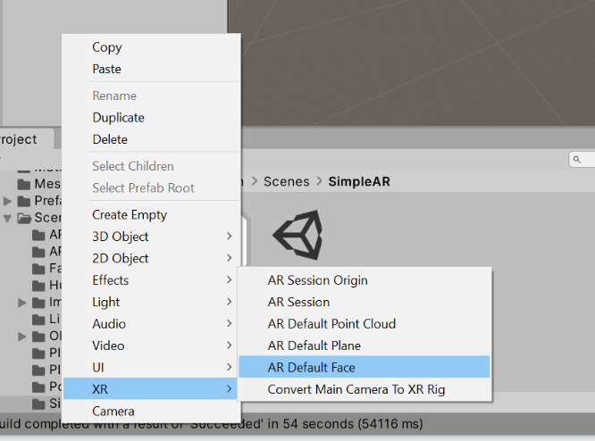
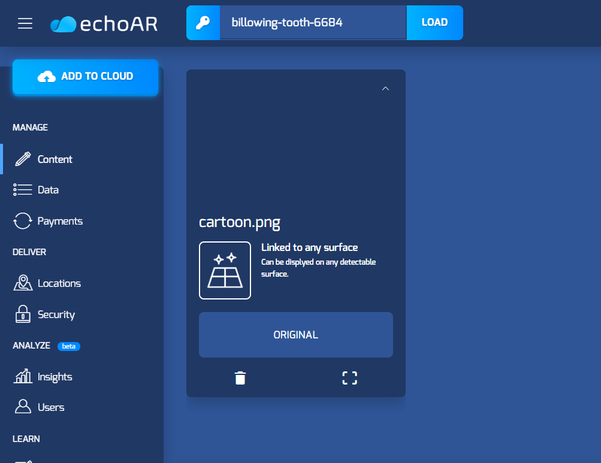

# Unity-echoAR-demo-Face filter

Simple Face filter demo with Unity and echoAR.

## Register

Don't have an API key? Make sure to register for FREE at [echoAR](https://console.echoar.xyz/#/auth/register).

## Setup

### 1. Installing AR Foundation

To install AR Foundation through the Unity Package Manager, follow the instructions in the Unity documentation [here](https://docs.unity3d.com/Packages/com.unity.xr.arfoundation@3.1/manual/index.html).

### 2. Setup a simple AR application

Open the AR Foundation sample scene located in:

```
Assets > AR Foundation > Scenes > SimpleAR > SimpleAR
```


In the hierarchy click on the `AR Session Origin` game object.

In the inspector view, look for the `Place on Plane` script and set the `Placed Prefab` to the echoAR prefab in the `Assets > echoAR` folder.


### 3.  Adding AR Default Face
In the hierarchy, right click and choosr `XR-AR Default Face`



### 4.  Adding AR Face Manager and scripts
In the inspector view, click `Add component` and search for `AR Face Manager`and `CustomerBehaviour`. Then add` AR Default Face ` which we created previously to the `Face prefab`.


### 5.  Set your API key

Edit the echoAR prefab and set your API key through in the Inspector view.


### 6. Upload your face mask image to echoAR console



### 7. Change CustomBehaviour

Overwrite the exisitng *echoAR/CustomBehaviour.cs* script with the new CustomBehaviour.cs file

### 8. Run your application

Simply press the *Play* button in Unity. You can also build it in your phone.


## Learn More

Refer to our [documentation](https://docs.echoar.xyz/unity/) to learn more about how to use Unity and echoAR.

## Support

Feel free to reach out at [support@echoAR.xyz](mailto:support@echoAR.xyz) or join our [support channel on Slack](https://join.slack.com/t/echoar/shared_invite/enQtNTg4NjI5NjM3OTc1LWU1M2M2MTNlNTM3NGY1YTUxYmY3ZDNjNTc3YjA5M2QyNGZiOTgzMjVmZWZmZmFjNGJjYTcxZjhhNzk3YjNhNjE).
